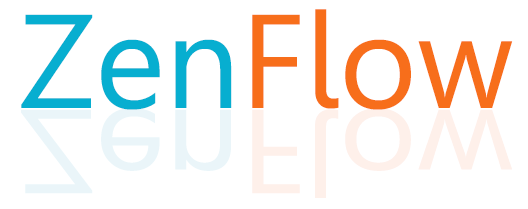

# ZenFlow v0.1 禅宗流

**ZenFlow** is an open-source Python 3 library for building and training artificial neural networks. The only dependency is Numpy (tested on 1.16.4). But in the future, we plan to add the support of Google JAX to enable the use of CUDA GPU.

**From Wikipedia**:

> The word **Zen** is derived from the Japanese pronunciation (kana: ぜん) of the Middle Chinese word 禅 (pinyin: Chán), which can be approximately translated as "*absorption*" or "*meditative state*".
>
> In positive psychology, a **flow** state, also known colloquially as being in the zone, is the mental state in which a person performing some activity is *fully immersed in a feeling of energized focus*, full involvement, and enjoyment in the process of the activity.
>

---

### Currently support:
- Multi-layer densly connected neural network.

---

### Example:

Please find the Jupyter Notebook examples.

---

### Version:

current version **v0.1** - date: March-10-2021

**history versions:**

no history version 

